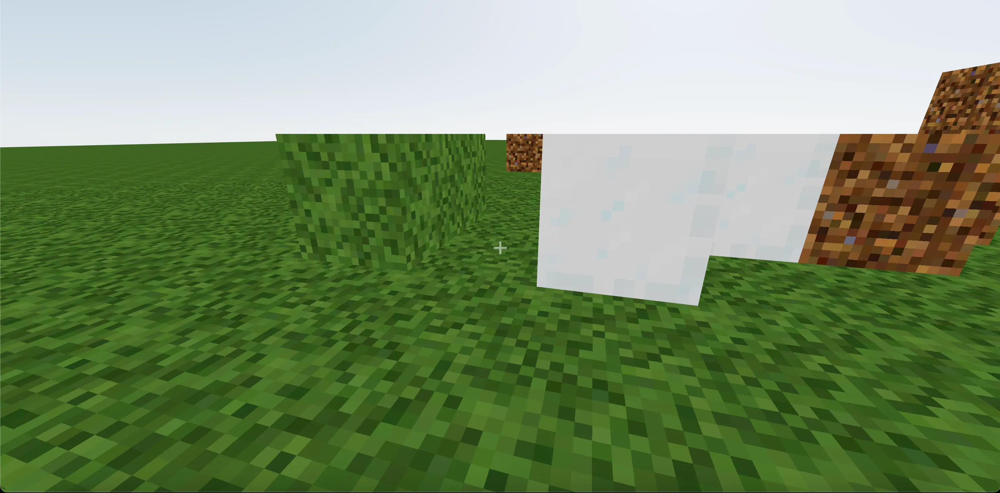
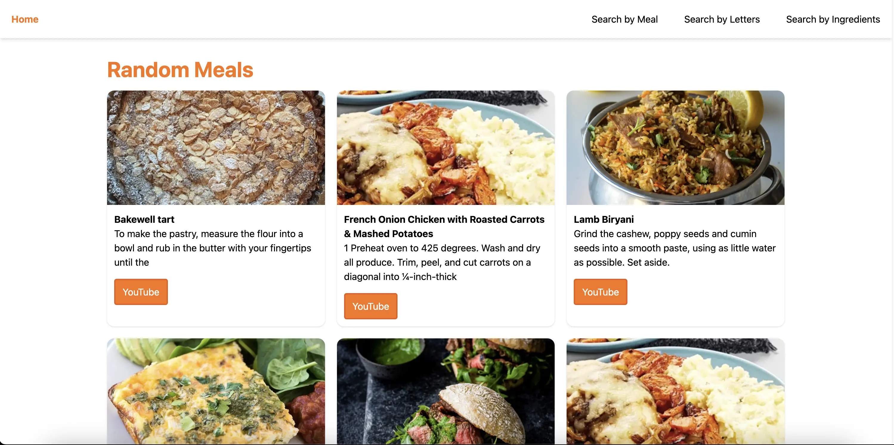

<!-- ## Hi there 👋 -->

<h1 align="center">Theses are some of my projects</h1>

    

        
        

            <a href='https://github.com/ajgadev/minecraft-with-react-and-three' target="_blank">Minecraft with react</a>
        

    

     
    

        
        

            <a href='https://github.com/ajgadev/vue-search-meal' target="_blank">Search meal with vue</a>
        

    

